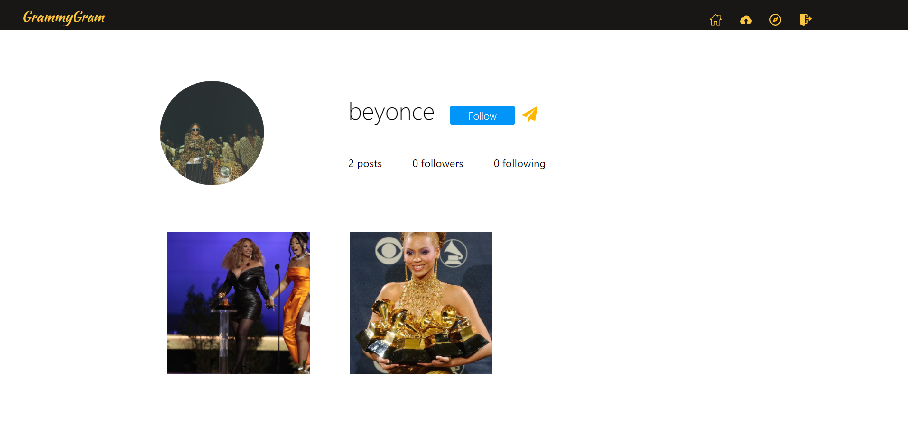

# Welcome to GrammyGram
Grammygram is a social media platform, Instagram Clone, that allows grammy award winning artists to share and connect with others like them.

Live site: https://instagrammygram.herokuapp.com/

## Technologies Used

| Back-End | Front-End |
| -------- | ----------|
| Python3 | JavaScript/|
| Flask | React |
| PostgreSQL | Redux  |
| SQLAlchemy | Font Awesome (icons)  |
| Alembic | CSS Modules |
| Docker | |
| Heroku(Deployment) |  |

## Splash Page

## Feed

## Profile Page

## Photo Upload

